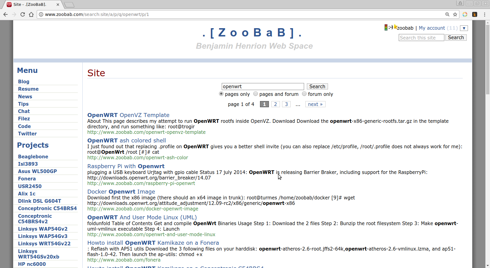
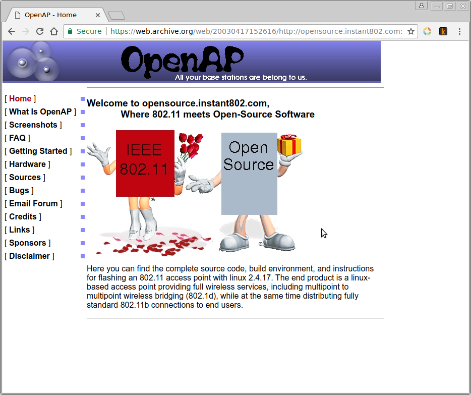
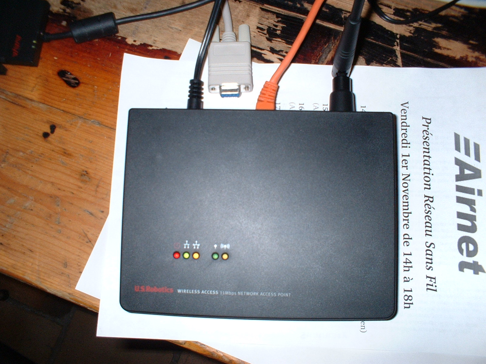
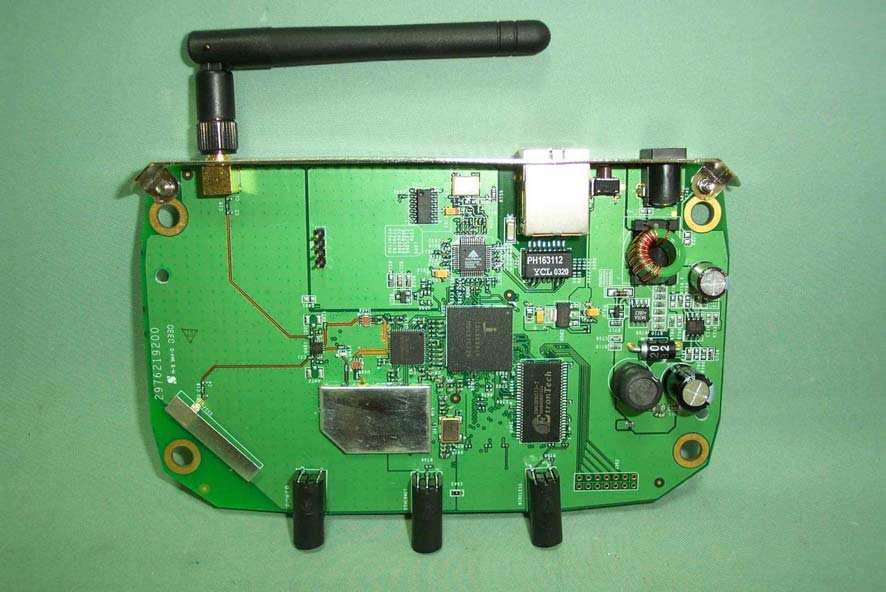
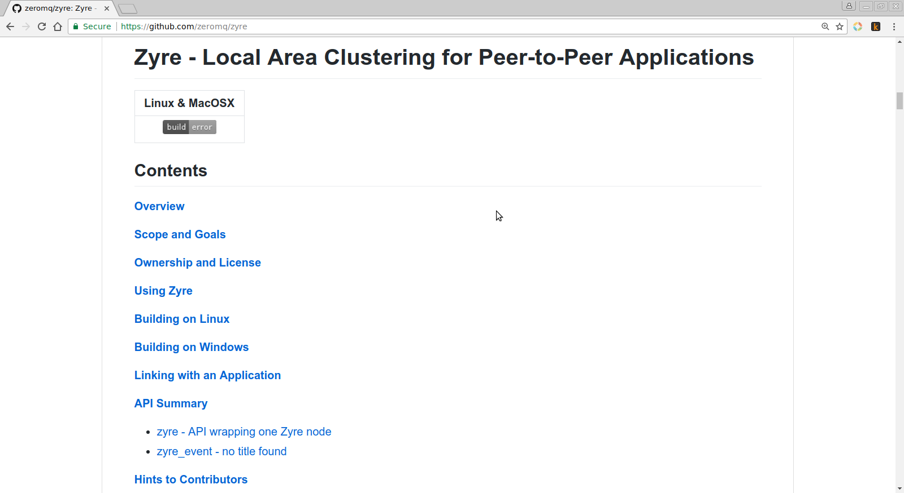
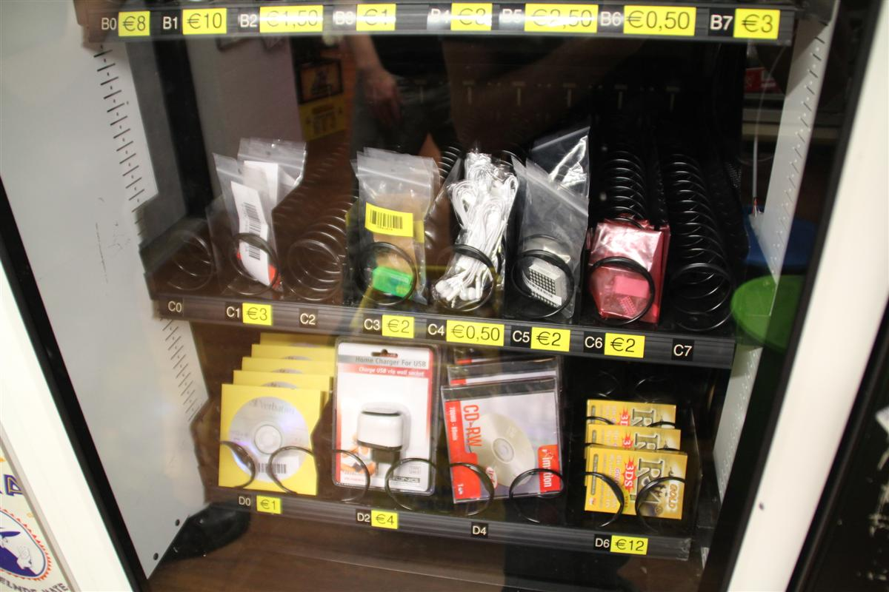
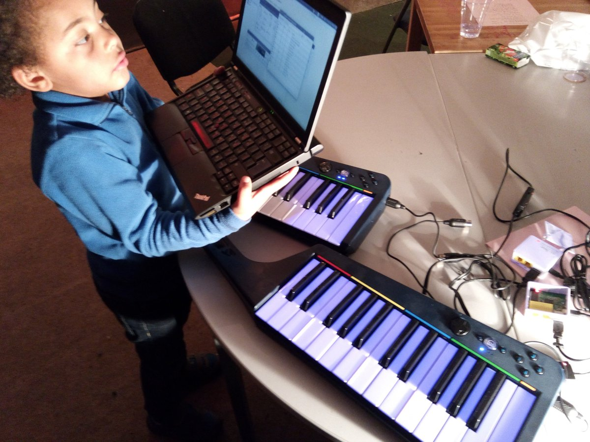
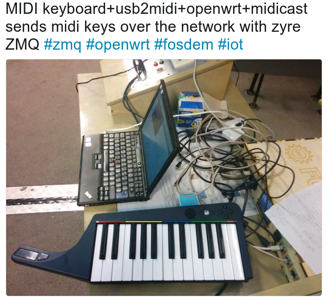
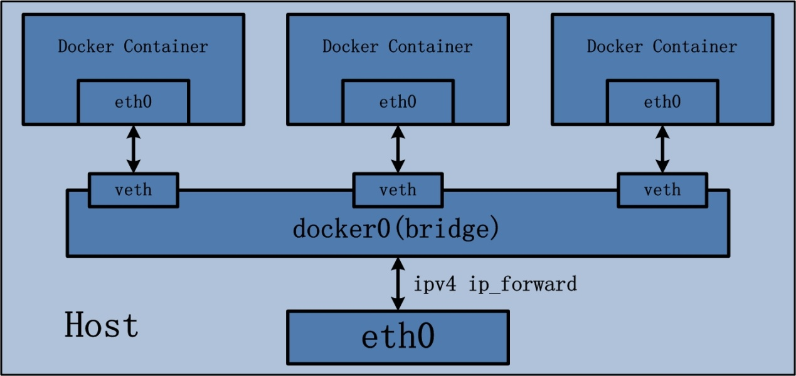
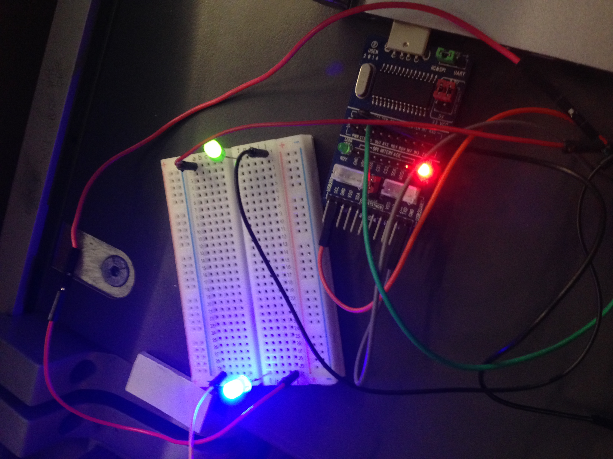

About
=====

Presensation of Zyre: p2p messaging to fuck the cloud, Pieter Hintjens last IOT project

FOSDEM 2020, Brussels, 02022020

Slides
======

## zoobab.com and openwrt

## openap, my first expensive linux router

## openap, 4mb of flash and 1mb ram

## isl3893, uClinux routers

## wrt54g and the web exploit

## Pieter Hintjens, best friend and ZeroMQ master

## Samsung Chord SDK and ZeroMQ

## ZeroMQ, the lightweight messaging library

## Zyre, an open-source framework for proximity-based peer-to-peer applications

## Glinet AR150, the router of choice

## Hardware vending machine at Revspace.nl

## Midicast at ZMQ hackaton

## Midicast at FOSDEM

## Docker bridge architecture to simulate zyre nodes

## Blink 2 LEDs with CH341A GPIOs and /sys/class/gpio


Videos
======

* Rebooting the GL-AR150 cluster: https://www.youtube.com/watch?v=FV3zgVt9HHA
* GL-AR150 blinken lichten: https://www.youtube.com/watch?v=3CRjeFdS4VY
* OpenWRT Summit 2017 presentation "F* the cloud, stay local - OpenWrt Summit 2017": https://www.youtube.com/watch?v=6UxQmvl4aaY
* This presentation at Fosdem2020: https://fosdem.org/2020/schedule/event/iotzyre/

Links
=====

* http://www.zoobab.com/ch341-usb-spi-i2c-uart-isp-dongle
* https://github.com/gschorcht/i2c-ch341-usb
* https://github.com/zoobab/openwrt-zmq-packages
* https://github.com/ZyreApps/DeMidi

Demo
====

Check the `demo` directory, and launch the 3 docker containers (led3, led5,
controller) with the shell scripts:

* Run 3 containers as slaves:
```
$ docker run -d zoobab/glar150
b6d495af00604457061bd13fce0867f097fccfe569c074c9869fb2c0c047bf4e
$ docker run -d zoobab/glar150
5af819f9d7123acc407aa6cefcb992ca2b59fc06a191b6dc4d5fd590cea95f44
$ docker run -d zoobab/glar150
cafe37cf9499d9f64f55b9154b84d93038912ae091033e2f09aecd97b71499cd
```
* one master -c to control them all:
```
$ docker run -it zoobab/glar150 -c
glard v1.0.1 -- GL-AR150 demo'n
I: 17-11-01 17:52:04 using interface=eth0 my_uuid=C3A0AA7977B943D68AD5B7E1A5B8AEB4 my_name=C3A0AA
I: 17-11-01 17:52:04 JOINED peer=5A793D
I: 17-11-01 17:52:04 JOINED peer=CB5DA2
I: 17-11-01 17:52:04 JOINED peer=9EA303
```
* you should then type the command "pwd" and observer that it is launched on the 3 slaves:

```
pwd
9EA303: /

CB5DA2: /

5A793D: /
```

Future
======

* WIP: curve cryto support (SSH replacement)
* update openwrt packaging
* TOR find friends with onioncat
* Turris Omnia Tetris runs ZeroMQ!
